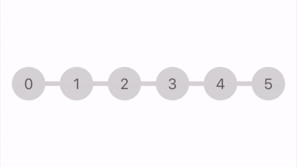

# ConnectedDots

[](http://cocoapods.org/pods/ConnectedDots)
[](http://cocoapods.org/pods/ConnectedDots)
[](http://cocoapods.org/pods/ConnectedDots)



## Installation

ConnectedDots is available through [CocoaPods](http://cocoapods.org). To install
it, simply add the following line to your Podfile:

```ruby
pod 'ConnectedDots'
```

## Usage

You can create the view through code or InterfaceBuilder

To configure control from code use
```swift
//Total number of dots
dots.numberOfDots = 8

//Default fill color
dots.defaultColor = .blue

//Dot radius
dots.dotRadius = 20.0

//Width of line that connects dots
dots.connectorLineWidth = 6.0

//Whether to show number inside dot
dots.showText = .blue

//Dots number font
dots.textFont = UIFont.systemFont(ofSize: 20.0)

//Change dot selection outline color and width
dots.selectionOutlineColor = .red
dots.selectionOutlineWidth = 2.0

//Change content insets 
dots.insets = UIEdgeInsets(top: 0, left: 20, bottom: 0, right: 10)


```

There are three options available for dots selection:

  * **none** - user can't select dot by tapping on it

  * **direct** - user selects dot by tapping on it

  * **progressive** - works more like UIPageControl. Tapping from the right side selects next dot. Tapping from the left side selects the previous dot.

Default is **direct**. Change it from code:
```swift
dots.selectionType = .progressive
```


Use **delegate** if you want to limit selection of some dots
```swift
dots.delegate = self

func connectedDots(_ connectedDots: ConnectedDots, shouldSelectDotAt index: Int) -> Bool {
	return index % 2 == 0
}
```

To set dots fill color use following functions
```Swift
//Apply fill color to dot at index
dots.setFillColor(.orange, forDotWithIndex: 1)

//Remove fill color for dot at index
dots.resetDotFillColor(atIndex: 1)

//Remove fill color for all dots
dots.resetFillColors()
```

To select dot programmatically
```Swift
//Select dot at index
dots.selectDot(atIndex: 6)

//Deselect dot
dots.deselectDot()

//Get selected dot index
dots.selectedDotIndex
```


To be notified about dot selection change use `Value Changed` event. Create connection to IBAction from Interface Builder or use:
```swift
dots.addTarget(self, action: #selector(self.dotsSelectionChanged(_:)), for: .valueChanged)
```


## Author

Artur Balabanskyy, balabanskyy@gmail.com

## License

ConnectedDots is available under the MIT license. See the LICENSE file for more info.
